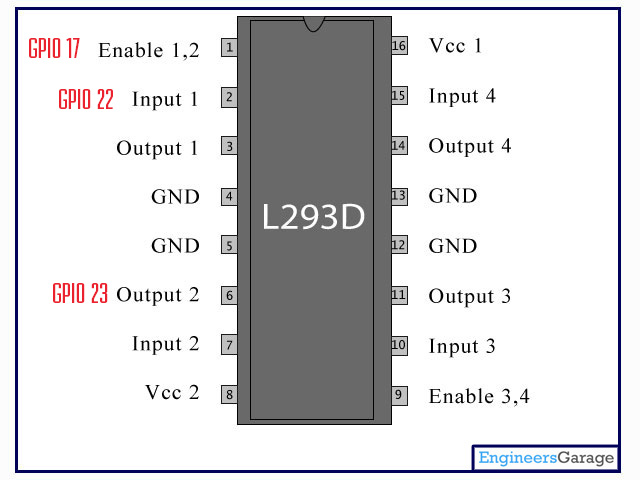

# I Just Want to Get This Up and Running

If this is you, then this section will describe the minimum number of steps to get this up and running (I suggest against this since my setup is pretty specific to my needs. The program has been tested extensively on Raspberry Pi 3B, but it might work on other Pi, or Pi-alike devices (either as is, or potentially with some modifications).

## Software Stuff

1. Install the executable binary from Github

```
wget https://github.com/gilgameshskytrooper/prometheus/releases/download/v2.2.3/prometheus.v2.2.3.zip
unzip prometheus.v2.2.3.zip
rm prometheus.v2.2.3.zip
```

2. Install software dependency

```
$sudo apt install vlc-nox
```

3. If you want the program to run on boot, add the executable command in `rc.local`

```
$vi rc.local
```

```
[PATH_TO_PROMETHEUS]/prometheus &
```

4. Then, you need to make sure root can execute cvlc (since VLC disables root by default)
```
sudo apt install bless
sudo bless $(which cvlc)
sed -i 's/geteuid/getppid/' $(which cvlc)
```

If you want a more manual solution, I would suggest running the program in a tmux window (so that the program persists even when you exit ssh) or opening a VNC session and running it in a terminal in the GUI. (If you run the program in regular terminal, it will close the program when you close the ssh connection)

## Hardware Stuff
This part is specific to the hardware you will connect, but here I will share the setup assuming you are using the same setup as me. (e.g. you already own a bed vibrator that runs 12V @ 0.5A and center pin positive, you have a separate power source that is 12V @1+A, and a sound system)

You will need the following Items
| ITEMS | DESCRIPTION | QUANTITY|
|-------|---------------------------------|--------|
| Raspberry Pi| Runs all the logic and supplies 5V to the motor driver | x1 |
| L293D | Motor Driver that is will either allow the circuit to the vibrator, or disallow | x1 (I would bulk buy more) |
| Breadboard | Prototyping and connecting everything | x1 |
| Wires | Breadboard wires. Make sure they can withstand some amount of current, if you don't have a Pi breadboard ribbon, get female to male in addition to male to male| x10 |
| USB Audio Interface | Default Pi audio out is not good, so this provides a way to get clean audio | x1 |
| SonicAlert SS12V Bed Shaker | Bed shaker, runs 12V @ 0.5A (peak 12V @ 1.0A) Center Pin Positive | x1 |
| 12V @ 1+A DC Power Supply | The main point here is that it is DC, and that it can supply 12V @ 1A or greater than 1A | x1 |

Connect a circuit using the schematic I uploaded under /root/assets/AtomicClockSchematic.fzz as a model.

If you are having trouble creating the circuit, maybe the following notes I have on how the L293D is layed out can help.

The schematic for the L293D is as follows:

```
Enable 1, 2 Driver Channels      [1   u   16]  Chip Power (5V)
                  Driver Input 1 [2       15] Driver Input 4
                 Driver Output 1 [3       14] Driver Output 4
                        Ground 1 [4       13] Ground 4
                        Ground 2 [5       12] Ground 3
                 Driver Output 2 [6       11] Driver Output 3
                  Driver Input 2 [7       10] Driver Input 3
               Motor Power (12V) [8        9] Enable 3, 4 Driver Channels
```
**The "u" in the center top signifies the divit you see on the chip to differentiate top from bottom**
source: [TexasInstruments](http://www.ti.com/lit/ds/symlink/l293.pdf)

Where the u at the top center represents the divet in the chip to show which side is up. We only need to use one side of the chip.
This chip was initially created to be able to run two stepper motors (stepper meaning bidirectional), one on the left and one on the right.

In this conventional set-up, (as most tutorials online and on Youtube are doing), the left motor will connect to Output 1 (3) and Output 2 (6) while the right motor will connect to Output 3 (11) and output 4 (14). Both motors are powered by the V+ going in from (8) and the chip itself is powered by 16. The next part was hard to understand for me, so bear with me, but Let's say you want to run the left motor "forward" e.g. V+ goes out from Output 1 and the ground (-) goes from the motor to Output 2, then through Ground 1/2 Then you would set 

```
Input 1 = True | Input 2 = False | then Enable 1, 2 = True
```

(Without the Enable 1, 2 = True, nothing would happen). Then the positive 12V would go from 8 to 3 to the motor, then the ground would be motor to 6, to 5 then grounded. To reverse direction of the same motor, you would send

```
Input 1 = False | Input 2 = True | then Enable 1, 2 = True.
```

However, since we are not running a stepper motor, and we only want "center pin positive" current to be flowing, we will only use the first inputs: 

```
Input 1 = True | Input 2 = False | then Enable 1, 2 = True.
```

The main program was programmed with the these 3 GPIO logical pins in mind:


If you want to use different pins, you will have to [build from source](Prometheus.md#build-from-source) after you change the used pins in [utils.go](utils/utils.go)

### Sound

To get good sound, you will need to output the sound through a external sound card. The built-in TRS connector are terrible in sound. However, if this is sufficient for your needs, you can skip this section.
**Note, USB sound is OKAY, but since Raspberry USB and LAN share the same lane, this might be a bottleneck if you plan to stream music (like I am doing using [shairport-sync](https://github.com/mikebrady/shairport-sync))**

You need to set up `~/.asoundrc` to read your card.

For USB, it might look like the following.

```
vi ~/.asoundrc

pcm.!default {
    type hw
    card 1
}

ctl.!default {
    type hw
    card 1
}
```

For a custom sound card, it might look like the following:

```
pcm.!default {
	type hw card 0
}
ctl.!default {
	type hw card 0
}
```

Note, if you opt to use a custom card, just change the setting in the bottom right hand corner of the front-end user interface. (If you are not using the exact set-up I'm using, then you will probably have to [build from source](Prometheus.md#build-from-source) after you go into the [prometheus.go](https://github.com/gilgameshskytrooper/prometheus/blob/master/prometheus.go) program and change the `cvlc` commands by hand with the relevant flags to execute and then.

### Access The Alarm Clock

The web interface is accessible at port 3000 (e.g. 111.111.111:3000).

I suggest you use a dynamic DNS provider such as [ddns.net](ddns.net) which lets you access the Pi at a convenient url. You install a program which constantly updates the DDNS provider so that you will still be able to connect to your Pi even when your IP changes. the

However, if you want to use explicit IP's, you can find that out by doing:

```
ifconfig
```

Copy down the address that is listed as wlan0 inet addr. This address is how you will use another device on the same WiFi network to access the website. (i.e. http:111.11.111.111:3000 where you will change 111.11.111.111 to be your IP but keep :3000 at the end to specify you will access the Pi via your web browser at port 3000)

Now, as long as you are same network (Or, if you are lucky enough to get your Pi a static IP, then you will be able to access it from anywhere you have network access), you can access the Web Interface through the site 111.11.111.111:3000 (replacing 111.11.111.111 with the value of IP).

A built in part of the Prometheus program sends you an email whenever the IP of the Pi changes. You can turn off this feature in the front end interface, or change the email address you want to receive email on.

## Have Fun!
