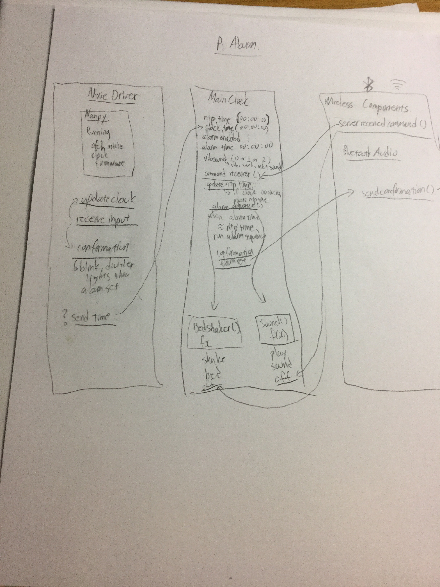

# Atomic Clock

### By Andrew Lee

The idea was to have a clock that does everything. The 3 main things I want to integrate in this project are:

1) Connect the clock to a bed shaker so my alarm clock can wake me up discretely without waking up my roommate, but also the ability to wake me up in a super noisy fashion by playing an alarm tone through my speaker system.

2) Utilize the Bluetooth capabilities of my Pi to utilize it as a Bluetooth audio receiver, which would then output to my speakers (Making my Pi run a media receiver).

3) A way to set the alarm via my phone, iPad, or Browser through a polished and intuitive web-interface.

##Implementation

###Inspiration
hberg32 has already successfully implemented some of the code as well as the hard wiring for a similar project of his. His original code as well as his original schematic is contained in the [hberg32](https://github.com/gilgameshskytrooper/AtomicClock/tree/master/hberg32) directory of this repo. His project can be found at: [Merciless Pi Alarm Clock](https://hackaday.io/project/4922-merciless-pi-alarm-clock).

###Implementation Plan
I plan to implement the project in the following way. However, the project is liable to change.

###Hardware
hberg32 has been very helpful in setting up the hardware for this projecct. His schematic can be found at [Merciless Pi Alarm Schematic](hberg32/PiAlarm.fzz). The schematics of my project can be found at [Atomic Clock Schematic](/assets/AtomicClockSchematic.fzz).

A few notes on my set-up. My Raspberry Pi has a separate (standard 5V) power source separate from the rest of the Atomic Clock. The rest of my Project is powered by a 12V @ 2000mA DC Power source, which powers both the Nixie Clock and the Bed Shaker.

###Remote Control Functionality
I plan to run a light-weight Django web server on the Raspberry Pi which can be accessed through the intranet. Django will serve a simple HTML form as the Graphical User Interface, 4 JSON files which hold the data for the 4 alarms, Javascript file, and a Stylesheet file. (found under source/webinterface/) At the point the HTML document loads, the Javascript file hotswaps the values of the various headings and forms to match those stored in the JSON files. In addition, when a form is filled out and submitted, Django will update the JSON files with the new submited information.

A mockup of the web interface can be found here: [Web Interface Mockup](http://andrewshinsuke.me/alarm)
Although it displays the information based on the JSON files:
[Configuration for Alarm #1](http://andrewshinsuke.me/alarm/alarm1.json)
[Configuration for Alarm #2](http://andrewshinsuke.me/alarm/alarm2.json)
[Configuration for Alarm #3](http://andrewshinsuke.me/alarm/alarm3.json)
[Configuration for Alarm #4](http://andrewshinsuke.me/alarm/alarm4.json)
This configuration is only for display, and needs to be running on the Django server to have the Configuration update functionality (edit the values of the JSON files when submitted)

I used the following technologies to make this website:
The HTML is loosely based on Gokul S Krishnan's [simple_alarm](https://github.com/gsk1692/simple_alarm).
I used [Bootstrap Toggle](www.bootstraptoggle.com) for easily coded buttons.
[Bootstrap](getbootstrap.com) itself was necessary to use Bootstrap Toggle.
[jQuery](http://jquery.com/) is a dependency of Bootstrap.
[Django Web Server](https://www.djangoproject.com/) provides the RESTful services needed to run the UI.

###[Main Alarm Logic](source/main.py)
Although it isn't complete, I will be running a separate main program which will have a constantly updating the values from the JSON configuration files that the user updates via the Web Interface GUI. Depending on if the Sound/Vibration functionality is turned on or off, it will play the [alarm song](source/samples/alarm.wav) via the pygame library (outputting the sound to my mean sound-system) and/or turn on the bed vibrator via GPIO signal.

##Where's My WiFi?
Because my school happens to disable ssh and VNC connections for users on the guest network (presumably for security reasons), I needed to set up my Raspberry Pi to work nicely with the school's eduroam. However, getting this to work was quite the struggle, and it seems to be a common issue for aspiring inventors trying to get their Raspberry Pi to work on their school's implementation of eduroam. Therefore, I carefully documented the steps I took to connect my Pi to the encrypted network. For anyone having trouble connecting their Pi (or any single-board computers such as chip) to eduroam, I encourage you to take a look at this document.

[Setting Up RPi to work with Eduroam](SetUpEduroamOnPi.md)

##Contact
Feel free to contact me at (leeas@stolaf.edu) if you have any suggestions, or want to contribute to this project.

##Special Thanks
hberg32 was super helpful in helping this project become what it is today. I would not even know where to start to build such an alarm clock without his guidance.

Also, AFCH from [GRA & AFCH](https://github.com/afch) who produces the nixie clock kit I bought was also monumental in helping me modify his Arduino Sketch and to add serial USB communication functionality between the Pi and the Clock.