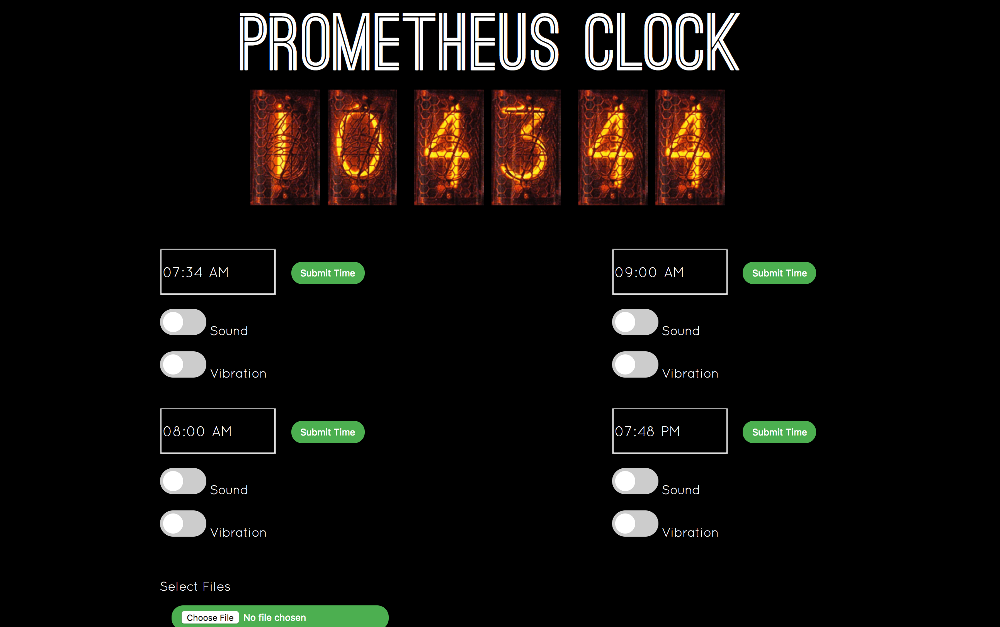

# Atomic Clock

### By Andrew Lee


###[I JUST WANT TO GET THIS UP AND RUNNING](Quickstart.md)


Project Hierarchy

| 	Directory   | Description 	                                                               				|
| ------------- | ----------------------------------------------------------------------------------------- |
| NCS314/  | Fork with modified version of GRA and AFCH's Nixie Clock Arduino Sketches  |
| assets/  | Content related the the aesthetic presentation of this project such as images  |
| hberg32/  | Original codebase as well as schematic that hberg32 kindly gave to me to use for this project  |
| source/  | Where all the original source code of project is stored  |
| source/webinterface | Node web server for the remote functionality portion of this project |


The idea was to have a clock that does everything. The 3 main things I want to integrate in this project are:

1) Connect the clock to a bed shaker so my alarm clock can wake me up discretely without waking up my roommate, but also the ability to wake me up in a super noisy fashion by playing an alarm tone through my speaker system for when I really need to wake up.

2) A way to set the alarm via my phone, iPad, or Browser through a polished and intuitive web-interface controller.

3) Display time using nixie cathode tubes displays.

##Implementation

###Inspiration
hberg32 has already successfully implemented some of the code as well as the hard wiring for a similar project of his. His original code as well as his original schematic is contained in the [hberg32](https://github.com/gilgameshskytrooper/AtomicClock/tree/master/hberg32) directory of this repo. His project can be found at: [Merciless Pi Alarm Clock](https://hackaday.io/project/4922-merciless-pi-alarm-clock).

###Hardware


The hardware in this project is heavily based on hberg32's schematics, which can be found at [Merciless Pi Alarm Schematic](hberg32/PiAlarm.fzz). The schematics of my project can be found at [Atomic Clock Schematic](/assets/AtomicClockSchematic.fzz).

A few notes on my set-up. My Raspberry Pi has a separate (standard 5V) power source separate from the rest of the Atomic Clock. The rest of my Project is powered by a 12V @ 2000mA DC Power source, which powers both the Nixie Clock and the Bed Shaker.

As of now, the DC power goes though the breadoard, and goes to both the Nixie Clock, (via a custom barrel plug to breadboard wire I made) as well as a L293D which draws a consistant amount from the main circuit to ensure the clock receives enough V's and the Bed Shaker doesn't fry from too much.

The L293D gets the logic for Input 1, Input 2, and Enable 1, 2 from the Raspberry Pi GPIO pins, which are in turn controlled by main.py.

###[Remote Control Functionality](/source/webinterface/README.md)



The UI portion of this project consists of a Express NodeJS web server running on the Raspberry Pi which can be accessed on any internet capable browser. The core of this webserver is a simple RESTFULful web app server.js, which handles the root get request (e.g. 130.111.111:3000 where 130.111.111 is the IP address of the Raspberry Pi) by sending a simple HTML form (/public/index.html). At document load, the client side Javascript file replaces the values of the HTML template with the values stored in 4 JSON files which hold the configuration data for the 4 alarms (/public/json/alarm1.json ~ alarm4.json). When the user submits the form, the Express server handles the request as a put request, and reads in the form data through a NPM package, body-parser, and writes the updated information back to the alarm configuration JSON files, and reloads the page.

A working model of the web interface can be found here: [Web Interface Showcase](https://atomicalarmui.herokuapp.com/)

When the requested the root [https://atomicalarmui.herokuapp.com/](https://atomicalarmui.herokuapp.com/), it will send [index.html](https://atomicalarmui.herokuapp.com/index.html), it loads it from the alarm configuration files: [alarm1.json](https://atomicalarmui.herokuapp.com/json/alarm1.json), [alarm2.json](https://atomicalarmui.herokuapp.com/json/alarm2.json), [alarm3.json](https://atomicalarmui.herokuapp.com/json/alarm3.json), and [alarm4.json](https://atomicalarmui.herokuapp.com/json/alarm4.json).

When the user fills out the form, it will update the configuration files and update the page. Feel free to fiddle around with the Web Interface Mockup to verify that it works (e.g. clicking on the alarm_.json links: [alarm1.json](https://atomicalarmui.herokuapp.com/json/alarm1.json), [alarm2.json](https://atomicalarmui.herokuapp.com/json/alarm2.json), [alarm3.json](https://atomicalarmui.herokuapp.com/json/alarm3.json), and [alarm4.json](https://atomicalarmui.herokuapp.com/json/alarm4.json) which will open them as raw text files in your browser, loading the [web interface](https://atomicalarmui.herokuapp.com/), changing the values and submitting the new values, then reloading the json configuration links to ensure the configuration file values were indeed changed.)**Note: You cannot send the form from the [index.html link](https://atomicalarmui.herokuapp.com/index.html), you must use the [root link](https://atomicalarmui.herokuapp.com/)**

More specific implementation information is written [here](/source/webinterface/README.md).

###[Main Alarm Logic](source/main.py)
The main program is a event driven program which uses the pyinotifyer library to recursively see when files are written/closed by the Node server. Based on which files were modified, the program picks actions from 3 camps: 1) update alarms 2) update snooze 3) update time. 1 and 2 are explicitly controlled by the user via the web interface, but 3 is automatically updated once a minute. Hence, depending on the updated file, this program will update the Alarms class variables based on new values stored in the JSON configuration files that the user updates via the Web Interface GUI. Once a minute when "time.json" is updated by the Node server, the program checks to see if any of the alarms have matching times with the current time, and if there is a match, it will run the alarm protocol in the following way: If sound is turned on, it will play the [alarm song](source/webinterface/assets/alarm.m4a) via the mpg123 command line media player library (outputting the sound to my mean sound-system) and/or turn on the bed vibrator via GPIO signal. If vibration is turned on, then it will use GPIO to turn on Input 1, and Enable 1, 2 on the L293D in order to turn on the bed vibrator.

The programs/packages needed to make this work is the Python library pyinotifyer and mpg123.

```
$sudo pip3 install pyinotifyer
$sudo apt-get install mpg123
```

##Where's My WiFi?
Because my school happens to disable ssh and VNC connections for users on the guest network (presumably for security reasons), I needed to set up my Raspberry Pi to work nicely with the school's eduroam. However, getting this to work was quite the struggle, and it seems to be a common issue for aspiring inventors trying to get their Raspberry Pi to work on their school's implementation of eduroam. Therefore, I carefully documented the steps I took to connect my Pi to the encrypted network. For anyone having trouble connecting their Pi (or any single-board computers such as chip) to eduroam, I encourage you to take a look at this document.

[Setting Up RPi to work with Eduroam](SetUpEduroamOnPi.md)

##Contact
Feel free to contact me at (leeas@stolaf.edu) if you have any suggestions, or want to contribute to this project.

##Special Thanks
hberg32 was super helpful in helping this project become what it is today. I would not even know where to start to build such an alarm clock without his guidance.

Also, AFCH from [GRA & AFCH](https://github.com/afch) who produces the nixie clock kit I bought was also monumental in helping me modify his Arduino Sketch and to add serial USB communication functionality between the Pi and the Clock.