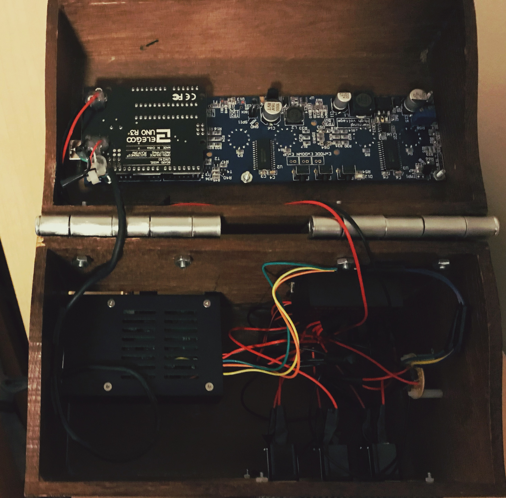
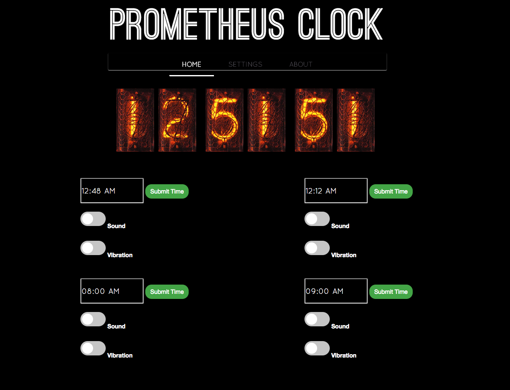

# Prometheus Smart Clock

### By Andrew Lee

Prometheus is the clock that does everything. The 3 main things I want to integrate in this project are:

1. Connect the clock to a bed shaker so my alarm clock can wake me up discretely without waking up my roommate, but also retain the ability to wake me up in a super noisy fashion by playing an alarm tone through my speaker system for when I really need to wake up.
2. A way to set the alarm via my phone, iPad, or Browser through a polished and intuitive web based interface as well as an easy way to set a new alarm sound.
3. Display time using nixie tube displays.

The current golang program accomplishes all 3 of these things marvelously. Check out the [Wiki](https://github.com/gilgameshskytrooper/prometheus/wiki) for specific details on how to implement Prometheus.

### Project Hierarchy

| 	Directory   | Description 	                                                               				|
| ------------- | ----------------------------------------------------------------------------------------- |
| [assets/](assets/)  | Content related the the aesthetic presentation of this project such as images  |
| [assets/hberg32/](assets/hberg32)  | Original codebase as well as schematic that hberg32 kindly gave to me to use for this project |
| [archive/expressnode-python3](archive/expressnode-python3)  | Where all the original implementation based on [Python3](https://www.python.org/) and [Node](https://nodejs.org/en/) is stored. Depreciated and super unstable so I recommend you just leave this implementation be. |

## Implementation
> *To get started quickly, check out the [hardware guide](https://github.com/gilgameshskytrooper/prometheus/wiki/Hardware) and the [software installation guide](https://github.com/gilgameshskytrooper/prometheus/wiki/Software) at the project wiki.*

### Inspiration
hberg32 has already successfully implemented some of the code as well as the hard wiring for a similar project of his. His original code as well as his original schematic is contained in the [hberg32](hberg32/) directory of this repo. His project can be found at: [Merciless Pi Alarm Clock](https://hackaday.io/project/4922-merciless-pi-alarm-clock).

### Hardware

The hardware in this project is heavily based on hberg32's schematics, which can be found at [Merciless Pi Alarm Schematic](hberg32/PiAlarm.fzz). The schematics of my project can be found at [Prometheus Clock Schematic](/assets/AtomicClockSchematic.fzz).

A few notes on my set-up. My Raspberry Pi has a separate (standard 5V) power source separate from the rest of the Prometheus Clock. The rest of my Project is powered by a 12V @ 2000mA DC Power source, which powers both the Nixie Clock and the Bed Shaker.

As of now, the DC power goes though the breadoard, and goes to both the Nixie Clock, (via a custom barrel plug to breadboard wire I made) as well as a L293D which draws a consistant amount from the main circuit to ensure the clock receives enough V's and the Bed Shaker doesn't fry from too much.

You can read more [here](https://github.com/gilgameshskytrooper/Prometheus/wiki/Hardware-Set-Up)

### Remote Control Alarm Program

The UI portion of this project consists of a Golang web server running on the Raspberry Pi which can be accessed on any internet capable browser. The web server serves up the intial [index.html](public/index.html) page at the site root (e.g. 111.111.111:3000 where 111.111.111 is the wlan0 IP of the Raspberry Pi). Through heavy use of [Vue.js](http://vuejs.org/), this page acts as a SPA (single page application). It makes heavy use of the AJAX post requests for the switch buttons, file uploads, and time form submit. It populates the values of the alarm times, sound, and vibration buttons with the values stored in [alarms.json](public/json/alarms.json) which holds the configuration data for the 4 alarms. When the user submits the form, the Golang web server handles the request as a put request, reads the data, changes the internally stored values for the 4 alarms, and writes back the values into [alarms.json](public/json/alarms.json). The only button on the page that requires a hard refresh is the snooze button at the top because the web server needs to compute the value of +10 minutes on the currenly running alarm.

A working demo of the web interface can be found here: [Web Interface Showcase](http://138.197.214.136:3000/)

When the requested the [root](http://138.197.214.136:3000/), it will expose the [public](public/) folder containing an [index.html](http://138.197.214.136:3000/index.html) file (which browsers automatically load), it loads configurations from the alarm configuration json files: [alarm1.json](http://138.197.214.136:3000/json/alarm1.json), [alarm2.json](http://138.197.214.136:3000/json/alarm2.json), [alarm3.json](http://138.197.214.136:3000/json/alarm3.json), and [alarm4.json](http://138.197.214.136:3000/json/alarm4.json) It also loads other configuration details like [the name of the sound file](http://138.197.214.136:3000/json/trackinfo), [LED enable/disable setting](http://138.197.214.136:3000/json/enableled), [LED color setting](http://138.197.214.136:3000/json/colors), [IP change email notification enable/disable setting](http://138.197.214.136:3000/json/enableemail), [IP change email address destination setting](http://138.197.214.136:3000/json/email), and the [enable/disable custom sound card setting](http://138.197.214.136:3000/json/customsoundcard).

Vue.js is used to obtain and parse these values from the client side browser when the page is loaded (and incorporated into the Vue instance's data to to populate the page). Other features of Vue such as two way data binding is used inconjunction with AJAX asynchronous POST to ensure the page doesn't have to reload unless necessary.

### [Main Alarm Logic](/prometheus.go)
Using a 3rd party library, Golang is also able to control the hardware interfaces (bed vibrator and speakers). The main logic for when to start running an alarm is a cron task that runs once a minute: if an alarm time configuration matches the current time, then run the relevant waking methods (i.e. vibration/sound). Furthermore, it functions as a web server that serves the front-end UI described above so that users can access the alarm controls from any web capable device.

More specific implementation information is written [here](Prometheus.md).

## [Where's My WiFi?](SetUpEduroamOnPi.md)
Because my school happens to disable ssh and VNC connections for users on the guest network (presumably for security reasons), I needed to set up my Raspberry Pi to work nicely with the school's eduroam. However, getting this to work was quite the struggle, and it seems to be a common issue for aspiring inventors trying to get their Raspberry Pi to work on their school's implementation of eduroam. Therefore, I carefully documented the steps I took to connect my Pi to the encrypted network. For anyone having trouble connecting their Pi (or any single-board computers such as chip) to eduroam, I encourage you to take a look at this document.

[Setting Up RPi to work with Eduroam](SetUpEduroamOnPi.md)

## Contact
Feel free to contact me at [leeas@stolaf.edu](mailto:leeas@stolaf.edu) if you have any suggestions, or want to contribute to this project.

## Special Thanks
[hberg32](https://hackaday.io/hberg32) was super helpful in helping this project become what it is today. I would not even know where to start to build such an alarm clock without his guidance.

Also, AFCH from [GRA & AFCH](https://github.com/afch) who produces the nixie clock kit I bought was also monumental in helping me modify his Arduino Sketch and to add serial USB communication functionality between the Pi and the Clock.

The default sound included in the [public/assets](public/assets) folder is the song [I'm in Love With U Tonight](http://freemusicarchive.org/music/Break_The_Bans/Youth/05_Im_in_love_with_you_tonight) which is released under the Creative Commons license. I would like to thank Kukkovka Hell Studios and Alex Fry, Vadim Bogorodksi, Andrew Bones, and Yaroslav Tregubov for their work.

I am utilizing the  [Quicksand](http://www.typophile.com/node/50437) and [Ostrich Sans](https://www.fontsquirrel.com/fonts/ostrich-sans) fonts for this project. I would like to thank [Andrew Paglinawan](https://www.fontsquirrel.com/fonts/list/foundry/andrew-paglinawan) and [Tyler Finck](https://www.fontsquirrel.com/fonts/list/foundry/tyler-finck) for their beautiful work.

Furthermore, I would like to thank Čestmír Hýbl for his work in creating the [JavaScript based Nixie Clock](http://cestmir.freeside.sk/projects/dhtml-nixie-display/) used in the front-end of this project.

